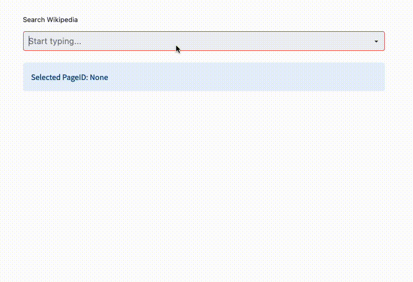

# streamlit-searchbox

- [streamlit-searchbox](#streamlit-searchbox)
  - [Installation](#installation)
  - [Overview](#overview)
  - [Usage](#usage)
    - [Example](#example)
    - [Styling](#styling)
  - [Contributions](#contributions)
    - [Contributors](#contributors)

---

A streamlit custom component providing a searchbox with autocomplete.




## Installation

```python
pip install streamlit-searchbox
```

## Overview

Create a searchbox component and pass a `search_function` that accepts a `str` searchterm. The searchbox is triggered on user input, calls the search function for new options and redraws the page via `st.experimental_rerun()`.

You can either pass a list of arguments, e.g.

```python
import wikipedia
from streamlit_searchbox import st_searchbox

# function with list of labels
def search_wikipedia(searchterm: str) -> List[any]:
    return wikipedia.search(searchterm) if searchterm else []


# pass search function to searchbox
selected_value = st_searchbox(
    search_wikipedia,
    key="wiki_searchbox",
)
```

This example will call the Wikipedia Api to reload suggestions. The `selected_value` will be one of the items the `search_wikipedia` function returns, the suggestions shown in the UI components are a `str` representation. In case you want to provide custom text for suggestions, pass a `Tuple`.

```python
def search(searchterm: str) -> List[Tuple[str, any]]:
    ...
```

## Usage

To customize the searchbox you can pass the following arguments:

```python
search_function: Callable[[str], List[any]]
```

Function that will be called on user input

```python
placeholder: str = "Search ..."
```

Placeholder for empty searches shown within the component.

```python
label: str = None
```

Label shown above the component.

```python
default: any = None
```

Default return value in case nothing was submitted or the searchbox cleared.

```python
default_use_searchterm: bool = False
```

Use the current searchterm as a default return value.

```python
default_options: list[str] | None = None
```

Default options that will be shown when first clicking on the searchbox.

```python
clear_on_submit: bool = False
```

Automatically clear the input after selection.

```python
rerun_on_update: bool = True
```

Use `st.experimental_rerun()` to reload the app after user input and load new search suggestions. Disabling leads to delay in showing the proper search results.

```python
edit_after_submit: Literal["disabled", "current", "option", "concat"] = "disabled"
```

Specify behavior for search query after an option is selected.

```python
style_overrides: dict | None = None
```

See [section](#styling) below for more details.

```python
style_absolute: bool = False
```

Will position the searchbox as an absolute element. *NOTE:* this will affect all searchbox instances and should either be set for all boxes or none. See [#46](https://github.com/m-wrzr/streamlit-searchbox/issues/46) for inital workaround by [@JoshElgar](https://github.com/JoshElgar).

```python
key: str = "searchbox"
```

Streamlit key for unique component identification.

### Example

An example Streamlit app can be found [here](./example.py)

### Styling

To further customize the styling of the searchbox, you can override the default styling by passing `style_overrides` which will be directly applied in the react components. See below for an example, for more information on the available attributes, please see [styling.tsx](./streamlit_searchbox/frontend/src/styling.tsx) as well as the [react-select](https://react-select.com/styles) documentation.

```json
{
   "clear":{
      "width":20,
      "height":20,
      "icon":"cross"
   },
   "dropdown":{
      "rotate":true,
      "width":30,
      "height":30,
      "fill":"red"
   },
   "searchbox":{
      "menuList":{
         "backgroundColor":"transparent"
      },
      "singleValue":{
         "color":"red"
      },
      "option":{
         "color":"blue",
         "backgroundColor":"yellow"
      }
   }
}
```

## Contributions

We welcome contributions from everyone. Here are a few ways you can help:

- **Reporting bugs**: If you find a bug, please report it by opening an issue.
- **Suggesting enhancements**: If you have ideas on how to improve the project, please share them by opening an issue.
- **Pull requests**: If you want to contribute directly to the code base, please make a pull request. Here's how you can do so:
  1. Fork the repository.
  2. Create a new branch (`git checkout -b feature-branch`).
  3. Make your changes.
  4. Commit your changes (`git commit -am 'Add some feature'`).
  5. Push to the branch (`git push origin feature-branch`).
  6. Create a new Pull Request.

### Contributors

- [@JoshElgar](https://github.com/JoshElgar) absolute positioning workaround
- [@dopc](https://github.com/dopc) bugfix for [#15](https://github.com/m-wrzr/streamlit-searchbox/issues/15)
- [@Jumitti](https://github.com/Jumitti) `st.rerun` compatibility
